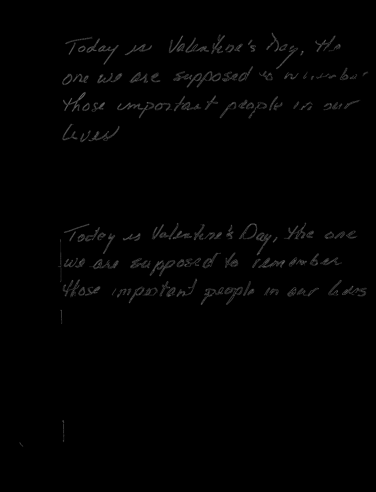
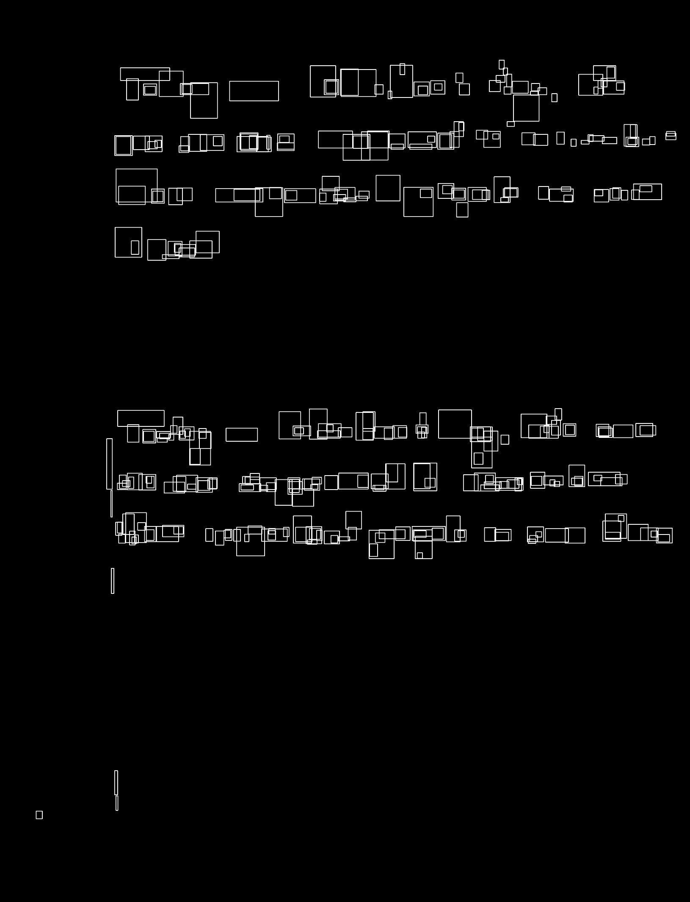
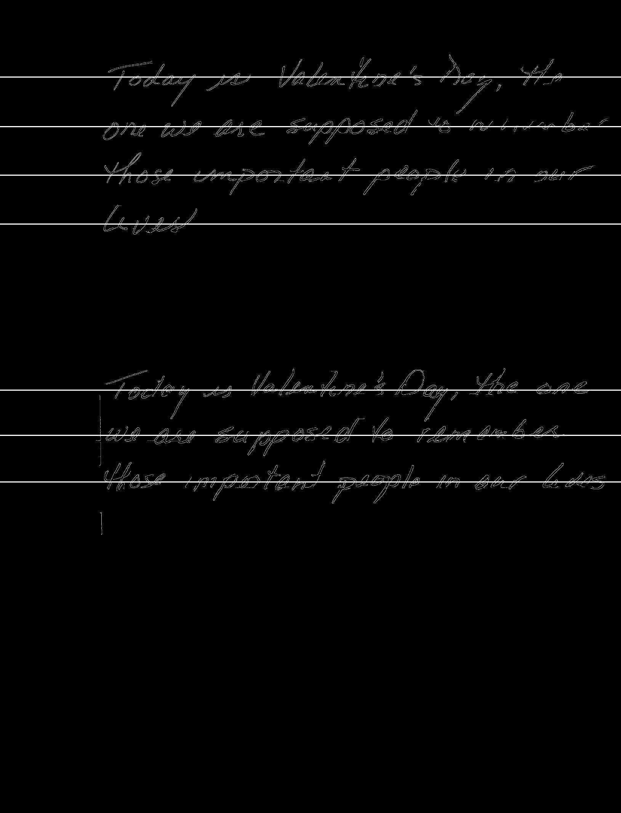
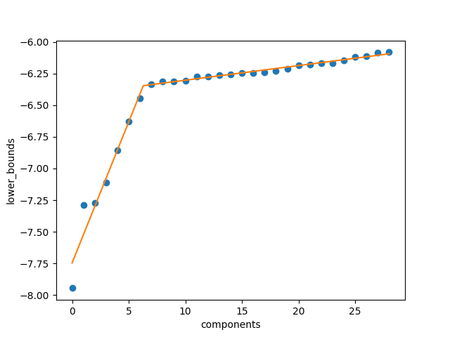

# **PreprocessingHTR**

This pre-processing system takes an image of a full, handwritten page and returns cleaned images of individual words separated by line. These images can be fed to Handwritten Text Recognition (HTR) systems, which often accept individual word images.

Periodically mentionned is the [SimpleHTR](https://github.com/githubharald/SimpleHTR) system, a handwritten text recognition model. This pre-processing tailors the color of the word images to perform well with this model, but it's applicable to all HTR systems.

*Example word output*:


## **Running**
```
> python mainProcessing.py test.jpg --save processed_folder
```
### Command line arguments
* `image`: the path to the input image.
* `--save`: the path to the folder where images of pre-processing steps may be saved.

## **Assumptions**

This work relies on a few key assumptions in order to function well:

* The input image is of a full, straight, (fairly) standard-size piece of paper with visible borders
* Text is written horizontally in non-overlapping lines
* The page contains no more than 30 lines of text – for reference, most lined paper has just 25 lines

## **Pre-processing Walkthrough**

## **Original image**

This is the original image.

Ideally, this image should be of a full page where all borders of the page are visible. The page should also be as straight and well-lit as possible. *Well-lit means the image isn't too dark, but also doesn't have too much glare*.


## **Bordered image**
`pageBordering.py`

The first pre-processing step is to border the page.

This can be done fairly simply using `cv2.findContours` and detecting the largest contour whose approximate shape is a square  (using `cv2.approxPolyDP`). Then, we can create an approximate rectangle from that contour and crop to it. The disadvantage to this method is that, if the page is not straight, then neither will the bordered image.

An alternative method is the `four_point_transform` from `imutils.perspective`, which actually transforms the page to be straight while cropping it, however, because this sometimes leaves the paper warped, the system currently uses the first method.

*A future improvement will both straighten the image and avoid warping.*


## **Page holes removed**
`circleRemoval.py`

To ensure that `cv2.canny` is as clean as possible, the page holes must be removed. Although we could just crop the margin, we'd rather not assume there's no text in this region.

This careful removal is done with `cv2.SimpleBlobDetector`, which can detect approximate circles, and therefore page holes given some well-calculated parameters.

To make the transition as smooth as possible, evenly-spaced points around the circled are sampled for color, those colors are averaged, and the hole is filled with this average. Then, the immediate area around the hole is blurred so that `cv2.canny` won't pick up much of an edge.


## **Lines removed**
`lineRemoval.py`

Removing the lines is crucial since these lines can connect one another in connected components – making their filtering impossible. This method does not completely remove the lines, but it does greatly disconnect the page line components.

Credit to https://vzaguskin.github.io/fourielines1/ for this technique, which uses hough lines and a Fourier transform to remove the lines. Doing this multiple times improves the output of `cv2.canny`, despite appearing to 'highlight' some sections of the page. Seemingly, these highlights have no effect on any future steps.


## **Grayscale & blurred**
`mainProcessing.py`

The image is then made grayscale and blurred in preparation for `cv2.canny`.


## **Edges (Canny)**
`mainProcessing.py`

Finally, apply `cv2.canny` to get the edges in the image. This is a good way to detect text on a now *relatively* bare page.

Fairly relaxed, non-variable parameters are used here in the hopes of picking up all text – any text not picked up here will not make it to the final output, so picking up everything, even if that includes noise, is ideal.


## **Connected components**
`connectedComponentsProcessing.py`

Perform `cv2.connectedComponentsWithStats` to analyze the components in the image. Here you can see a fun visualization of these components:


### **Connected components filtered**
`connectedComponentsProcessing.py`

Filter the connected compontents based on different stats such as area, bounding area, height, and so on.

Filtering notes:
- Area filtering: Define a minimum threshold via taking the mean of the top *k* areas and dividing this mean by a constant.

- Height/width filtering: Makes assumptions about the page size, which is why we assume a standard-size page.




### **Connected component borders**
`connectedComponentsProcessing.py`

Get the borders of the connected components, which is helpful to determine/separate lines of text.




### **Connected components filtered 2**
`connectedComponentsProcessing.py`

Filter the connected components yet again, this time removing 'stray' components based on y value. Although simple and unlikely to remove many components, this filtering is extremely important heading into text lines detection.


## **GMM-based text lines detection**
`lineClustering.py`

We use Gaussian Mixture Models to determine exactly how many, and the locations of the horizontal lines of text – which is where the roughly 'horizontal lines' assumption comes in.

The horizontal pixel sums across the image roughly resembles a series of isolated Gaussians, and these sums are fed to a `sklearn.mixture.GaussianMixture` model. The resultant means of the GMM model become the y values of the lines!




### **Obstacle: How many components do we use?**

Unfortunately, we don't get the image above so easily. First we must determine the number of components in the GMM, i.e., the number of lines. After trying many methods, we settled on the following:

- Fit GMMs with 1-30 components (This is where our <30-line assumption comes in). Analyze a graph of the losses (called `lower_bounds`) and realize: As soon as you fit all of the lines of text (i.e., have the correct number of components), any additional components will yield much less improvement in the loss.

This creates an almost piecewise linear graph of loss (with two line segments). By finding the changepoint between the two lines, we find the ideal number of components (i.e. lines). We do exactly this with the help of `optimize.curve_fit`!



Here, the rounded index of the changepoint is 6, to which we add 1 (Python indexing) for a total of 7 components/lines, which is the correct number for this image!

## **Space detection**
`wordAnalysis.py`

Once we've separated the document into lines, we must segment it into words. This consists of two main challenges: Determining where the dividing spaces are, referred to as `middles` in code, and also getting good looking final words images which can be fed into HTR systems.

<br>
<br>
<br>
<br>
<br>
<br>
<br>

In pursuit of robustness, segmenting the lines became a complex process, but let's first describe the intuition (simple approach):

Take a thresholded image and analyze runs of white pixels, i.e. gaps. This is done by taking a column sum and treating each sums of 0 (all white), as False, and any greater number as 1. We then turn this information into a series of gaps with different ranges, and filter the smallest gaps, theoretically leaving only gaps which are spaces.

Problems/caveats with the 'simple' approach:
 - **P1**: Letters can be slanted, and so any completely empty vertical space between two words could be non-existent!
 - **P2**: Performing this analysis on a thresholded image is problematic because there can't be any noise in the image - we need to have clean, large gaps for this to work! (Losing gaps)
 - **P3**: Performing this analysis on the existing, filtered connected components image won't be robust because disconnected parts of letters may have been removed - creating sizable gaps which don't exist! (Creating non-existent gaps)
 - **P4**: How do we determine some gap about which we should filter?

We attempted to address all of these problems.

**P1 solution**: Create a slanted (or un-slanted) image with variable angle `theta` to analyze the gaps in that image the exact same way as above. Convert gaps in the slanted image back to gaps in the original and then 'marry' the two sets of gaps. In fact, we go a step further and create an intersection of their gaps - we can be more confident about these, even when they're slightly smaller.


**P2 solution**:
- Use a more intelligent thresholding method which we call *multiple image thresholding*. Essentially, split an image horizontally into *n* equal segments, perform mean or OTSU thresholding on each of these segments, and re-combine them into a final, thresholded image. *n* is specified manually or, for text lines, it's determined by proportion of line width to page width. This method is more robust to changes in light across the image, resulting in less/smaller noise.
- This isn't enough alone. Although expensive, perform connected component analysis on a newly thresholded image and intelligently remove noise based on component size and distance from the mean y of components in the image.

*Compare the methods over a single word*:

OTSU thresholding alone


Multiple OTSU thresholding with cleaning


**P3 solution**: Why use an old, poorer connected component image of the line? It's a useful point of comparison: We have an over-estimation of gaps and an under-estimation. Empirically, the best dividers were found by doing the analysis on this image, finding the dividers, and removing any dividers in this analysis which weren't found for the thresholded image in *P2*. I.e., a gap in connected components image but not thresholded image implies a mistake due to missing components, so remove the gap.

**P4 solution**: This solution must be improved, but the current approach is to analyze the unfiltered gaps in all the lines. More specifically to consider the largest gaps in each image and perform some (rather unjustified) math to determine a `min_gap` above which a gap is considered a line. *If having trouble with this section of the pre-processing, start by manually experimenting with min_gap!*

*Note:*

- This description still doesn't cover its implementation in full, for example how we ‘marry’ the different kinds of gaps, or re-align the gaps in the slanted image, and so on. That said, there are many comments in the code to help!

- Overall, this system is working, but fails to perform robustly enough on all images. It will be improved upon in the future.

## **Individual words**

Once the spaces have been detected, the words are cropped by assigning each component in the line to a word image. This also ensures there's no horizontal overlap between words – at least for one of the two word images.

Two separate, thresholded images are produced for each word. 

- **(1)** One is cropped from the thresholded line image created by the space detection algorithm, although this was filtered 'well' for noise to allow for uninterrupted gaps, and this may have removed some letter segments.

- **(2)** The other is thresholded from the image and goes through the same cleaning, but with a higher tolerance for noise.

*The first image is cleaner but may have missing segments. The second is noisier but may contain segments the first image is missing*.

In general, one is better than the other, but it is unpredictable, so we take both images. Note that this isn't necessarily a problem, since HTR systems will return a confidence, or probability, along with their prediction. We can feed both images to the system and take whichever prediction has higher confidence! We can confirm this improves predictions using [SimpleHTR](https://github.com/githubharald/SimpleHTR).

Currently, once individual words are segmented, they're re-colored to be fed to [SimpleHTR](https://github.com/githubharald/SimpleHTR). This model was built on the IAM dataset, which requires images have very specific colors. The output images could just as easily be black and white.


Here are a few words, the leftmost being image **(1)**, the rightmost being image **(2)**:


<br>


<br>


<br>


<br>


## **Current Shortcomings // Future Improvements**

* Formal documentation: Add more formal documentation & improve the image saving system

* Bordering: A future improvement will both straighten the image and avoid warping.

* Poor GMM efficiency/assumptions: We do not have to fit 30 Gaussians to pinpoint the correct changepoint, nor do we have to assume there are less than 30 lines at all. More testing must be done to evaluate the robustness of the selection of components.

* Space detection robustness: Though working, the current space detection system isn't as robust as it should be.

* Raw word images: Provide the option to get back raw word images rather than those doctored for the [SimpleHTR](https://github.com/githubharald/SimpleHTR) system.

* Colored pen considerations: Colored pen could be detected and extracted much, much more easily than pencil, however this isn't currently being taken advantage of.


## **License & Credit**

*This repository is licensed under the MIT License. If using this work, we would appreciate being given proper credit!*